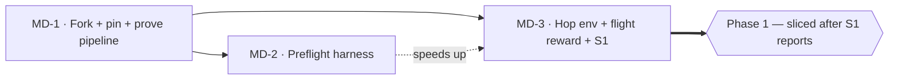

# Ticket Breakdown — Microduck Hopscotch, Phase 0

> Epic intent: [microduck-hopscotch-project-brief.md](../../microduck-hopscotch-project-brief.md)
> Architecture: [microduck-hopscotch-architecture.md](../../microduck-hopscotch-architecture.md)
> Sliced 2026-09-04. **Phase 0 only** — Phase 1 is deliberately unsliced until MD-3 reports.

## Epic summary

Teach Microduck to hop, then to hopscotch, training on Hugging Face Jobs and deploying to the real
robot. Phase 0 exists to answer one question before any of that is plannable: **can this robot
physically leave the ground?** Everything here either proves the pipeline or gets us to that answer.

## Why Phase 0 stops where it stops

The architecture's S1 spike determines the shape of a third of the remaining backlog. If Microduck
achieves a real flight phase, hopscotch is jumping and the reward/curriculum work follows the plan. If
it can't, hopscotch becomes *stepping into cells* — a different reward term, a different curriculum, a
different ticket set. Slicing Phase 1 now would mean writing tickets we'd delete. Phase 1 gets sliced
after MD-3.

**Note on sizing:** MD-1 and MD-2 are below the usual PIV ticket size (500–1500 lines). That's genuine,
not under-planned — one is repo setup plus verification, the other is a small harness. MD-3 is the real
implementation ticket and carries most of the weight. Padding the first two would be ceremony.

---

## Status (2026-09-04)

- **MD-1** — in progress. Fork merged and pinned, `uv sync` green, 149 CPU tests green. Remaining:
  HF auth + namespace, then the `--hf-jobs` run. Checklist: [`../upstream-pin.md`](../upstream-pin.md).
- **MD-2** — **demoted**. S3 resolved: the CPU stage runs locally in 55 s, so preflight is an
  optimization, not the thing that makes the loop affordable. Only its in-job smoke test still earns
  its place. Do MD-3 first.
- **MD-3** — first acceptance criterion (command-block semantics) is **already done**:
  [`../command-block.md`](../command-block.md). Two constraints added from the CPU probe
  ([`../s1-flight-probe.md`](../s1-flight-probe.md)): measure `n_contact == 0` gated on tilt AND
  trunk rise (contact-loss alone reads a topple as flight), and **do not put motion-blocker penalties
  on the neck** — head swing looks load-bearing for the hop.

## Tickets

### MD-1 — Fork upstream, pin it, and prove the stock pipeline end-to-end (S2)

**Scope / acceptance criteria** — one testable concern: *a stock Microduck policy trains on HF Jobs
from our fork and its artifacts land in our namespace.*

- `pollen-robotics/microduck_rl` forked into this repo, upstream retained as a git remote, pinned to a
  known-good commit (recorded in the repo, with the reason for that pin).
- `uv sync` succeeds and is honest — no manually-installed local packages. Upstream's own guidance is
  that `uv sync` is ground truth *because* HF Jobs runs it; anything working only locally dies remotely.
- HF auth working; namespace chosen deliberately (it governs repos, uv-cache bucket, **and billing**).
- Stock `Mjlab-Velocity-Flat-MicroDuck` submitted via `--hf-jobs` and run to a usable checkpoint.
- Verified and written down: `.pt` checkpoints appear in the private Hub model repo during training,
  wandb streams live, and the 12h timeout behaviour is understood.
- The resulting walking policy plays back correctly — this is our known-good reference for later A/Bs.

**Per-ticket context**
- Architecture: "What already exists", "Repo strategy", "Boundaries & contracts".
- Upstream: `scripts/hf/README.md`, root `README.md`, `src/mjlab_microduck/hf_jobs.py`.
- Retires the brief's original first milestone ("prove HF Jobs can run its normal training").

**Files touched** — repo root (fork import), `pyproject.toml`/lockfile if pins need adjusting, a short
`docs/` note recording pin + namespace + verification results.
**Rough size** — ~50–150 lines, mostly configuration and documentation. The work is verification, not code.
**Depends on** — none. This is the entry point.

---

### MD-2 — Preflight-in-one-job harness

**Scope / acceptance criteria** — one testable concern: *a config error dies in seconds on cheap CPU
instead of hours into GPU training.*

- A single job entry point that runs, in order and failing fast: CPU-runnable config tests → 64-env /
  5-iteration smoke test → full training.
- CPU stage runs on `cpu-basic` ($0.01/hr) where possible; GPU is only entered once preflight passes.
- **Proof of the guarantee:** deliberately invert a reward sign (or break a joint-index mapping) and
  demonstrate the job fails in the preflight stage, before any GPU time is billed.
- One cold start per iteration — stages share a job, they are not separate submissions.

**Per-ticket context**
- Architecture: "Compute & dev loop" (this ticket *is* that decision, made real), and spike **S3**.
- Upstream `CLAUDE.md`: the 64-env/5-iteration smoke test "catches ~95% of config errors"; existing
  CPU-runnable `tests/test_*_cfg.py` are the model for the first stage.
- This exists because we chose an all-remote dev loop with no local GPU. It is the mitigation that makes
  that choice affordable — without it, every typo costs a full remote round-trip.

**Files touched** — `scripts/` (new preflight/job-wrapper script), possibly small additions to `tests/`.
**Rough size** — ~200–400 lines including tests.
**Depends on** — MD-1 (needs the fork and a working `uv sync`).

---

### MD-3 — Minimal hop environment, simultaneous-flight reward, and the S1 spike

**Scope / acceptance criteria** — one testable concern: *a trustworthy, evidence-backed answer to
whether Microduck can achieve a flight phase.*

**This is a spike ticket. Its deliverable is a decision, not a feature.** "Done" does not mean the duck
hops well; it means we know whether it can, with data good enough to bet the next phase on.

- Exact command-block semantics read from source and **documented** — the 13D layout is
  `[twist(3), head_pose(4), body_pose(6)]`, but which `body_pose` component carries hop intent must be
  resolved from `microduck_constants.py` and `microduck_velocity_env_cfg.py`. This closes the largest
  open question in the architecture doc; fold the answer back into it.
- A velocity-derived hop env config module, registered, built on `make_microduck_velocity*_env_cfg` so
  domain randomization, obs noise, command delays and NaN guards stay in sync automatically.
- A **simultaneous-flight reward term** — both feet off the ground at once. Note mjlab's stock
  `feet_air_time` rewards *alternating* single-foot air time (ordinary walking) and is not a substitute.
- Minimal regularizers, per `CLAUDE.md`: motion-blockers (body angular velocity, angular momentum, pose
  std) kept **low** because they penalize exactly what dynamic motion requires; smoothness penalties
  (action rate, torque rate) **omitted at this stage** — introduced during exploration, "do nothing" wins.
- Chosen command slot non-zero from step 0 even at weight 0, or its input weights die permanently.
- CPU-runnable config tests: joint indices resolve against the real model, reward weights carry the
  intended sign, obs is 61D.
- **The sign check:** every `Episode_Reward/<penalty>` term logs ≤ 0 throughout training. Upstream calls
  this check infallible for catching sign inversions.
- S1 run: ~1000 iterations @ 4096 envs on `l4x1` (~2–4h, under $5), and the decision recorded:

```
Decision rule: >80ms consistent air time with upright landing  -> true hop track, hopscotch as designed.
               Ground contact never breaks / air time <30ms    -> pivot to "stepping" hopscotch
                                                                  (foot placement into cells, no flight).
```

- Air time measured against **tilt**, not just height — `CLAUDE.md` is explicit that height-only upright
  checks miss failure modes.
- Expect not to converge cleanly on the first try. Upstream: 2–5 reward-hacking iterations before
  convergence is normal. Judge failures from evidence (end-state clusters, air-time profiles) before
  changing rewards — past "failures" upstream were early checkpoints or mis-set success criteria.

**Per-ticket context**
- Architecture: "The core new reward: simultaneous flight", "Observation & command contract",
  "Missing pieces", spike **S1**.
- Upstream `CLAUDE.md`: reward design lessons (jackpot prevention, regularizer types, tracking Gaussian
  std), the "Adding a New Task" workflow, and the physics-verification step *before* training.
- Template: `microduck_velocity_env_cfg.py` is the main recipe.

**Files touched** — `src/mjlab_microduck/tasks/microduck_hop_env_cfg.py` (new), `tasks/mdp.py` (new
reward fn), `tasks/__init__.py` (registration, + `_BACKLASH_TASKS` if applicable), `tests/` (new cfg tests).
**Rough size** — ~600–1200 lines including tests. The real implementation ticket of Phase 0.
**Depends on** — MD-1. Strongly benefits from MD-2 (each failed iteration is otherwise a full GPU round-trip).

---

## Dependency graph



MD-2 and MD-3 are technically parallelizable — they touch different trees (`scripts/` vs
`src/mjlab_microduck/tasks/`) and neither consumes the other's output. The dotted edge is a cost
relationship, not a blocker.

## Suggested execution order

- **Wave 1:** MD-1 alone. Nothing else can start without the fork.
- **Wave 2:** MD-2, then MD-3.
  They *can* run in parallel worktrees, but if you're working solo, do MD-2 first. It's the small one,
  and it makes MD-3's inevitable 2–5 reward iterations dramatically cheaper. Parallelizing here trades
  real money for a little wall-clock.
- **Then:** re-slice Phase 1 against MD-3's answer.

## Deliberately not in Phase 0

Landing accuracy criteria · consecutive hops · the curriculum stages · course choreography · painted
course markers · the headless evaluation battery · sim2real hop validation (S4) · anything about the
physical robot. All of these are shaped by MD-3's result.
